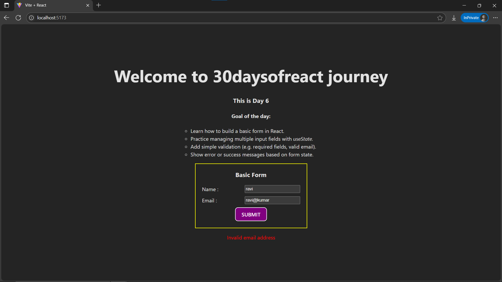

# Project: Basic Form with Email Validation – React

## 🚀 What I Built
A simple **React form** with two fields: **Name** and **Email**. The form uses **custom email validation** (via regex) and disables the browser's native validation UI. It displays error and success messages based on user input.

---

## 🧠 What I Learned
- Managing multiple input fields with a single `useState` object.
- Handling `onChange` and `onSubmit` events in React.
- Custom email validation using **regular expressions**.
- Using `noValidate` to disable the default browser validation.
- Conditionally rendering error/success messages.

---

## 🛠️ Tech Stack
- React + Vite
- JSX
- useState Hook
- Inline Styling
- Regex for validation

---

## 📸 Screenshot



---

## 🧪 How to Run Locally

```bash
git clone https://github.com/ravi18kumar2021/basic-form-react-app.git
cd basic-form-react-app
npm install
npm run dev